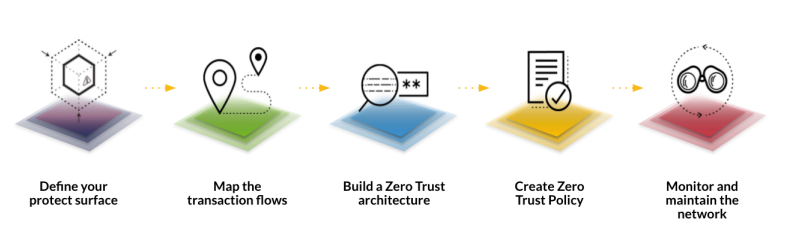
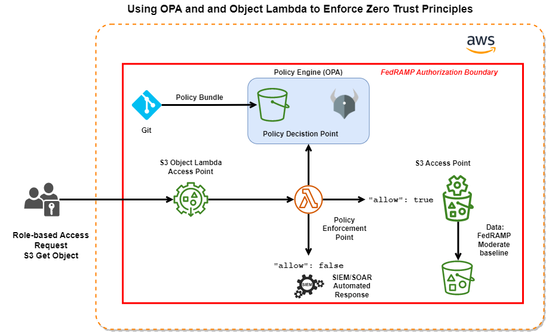

# Using OPA and Object Lambda to Enforce Zero Trust Principles

**Note**: I wanted to give thanks to **Adam Sandor** from **[Styra](https://www.styra.com)** for inspiration, assistance, 
and providing the OPAAuthorizer code and scripts used to build the Lambda.

Please see his [blog](https://www.styra.com/blog/securing-aws-s3-buckets-with-opa-and-object-lambda/) post for more information. 

## Zero Trust Model

Within the traditional network perimeter trust was implied. This can no longer be the case based on the shift to Cloud hosting, 
remote work and other types of modernization extend the protection surface beyond the corporate network.
The result is that organizations now need to determine how to implement a security framework based on zero trust principles 
that provided continuous verification of access to resources, all the time, for all resources, regardless of where the device
or application exists. Zero Trust is a security model that seeks to determine if the right person has that the right access to 
the right data.


Five-Step Process for Zero Trust Implementation, NSTAC Report to the President, Zero Trust and Trusted Identity Management

## Zero Trust Principles for Data Security
Zero trust principles can be applied to Data Security where every request for access to data needs to be authenticated to 
determine if access can be granted. 

1. Define the Protect Surface
In our demonstration the protect surface is defined as resources that exist within the FedRAMP authorization boundary.

2. Map The Transaction Flows
The transaction flow is initiated by a person or non-person entity who is attempting a access patient records that are
stored in an AWS S3 bucket.

3. Build a Zero Trust Architecture
The five-step process for zero trust implementation was used to develop the architecture used in the demonstration.

4. Create Zero Trust Policy
Zero Trust Policy has been implemented using infrastructure as code (IaC) and policy as code (PaC) so that access
to resources within the protect surface are continuously authenticated prior to granting access.

5. Monitor and Maintain the Network
The results of all policy decisions are stored in Splunk and continuously monitored. In the event that access is denied 
to a user or non-person entity a detection rule triggers the appropriate security orchestration and automated response
(SOAR) playbook.

## Running the demo in your environment
This demo shows how to authorize requests to Amazon S3 using OPA policies. The main components are:
1. Data Bucket: An S3 bucket storing sample data authorized by the Object Lambda.The S3 data bucket is configured to meet FedRAMP moderate baseline. 
2. Object Lambda: This will be our Policy Enforcement Point (PEP). Tha Object Lambda sends all information about the S3
request to OPA and enforces the resulting policy decision.
3. OPA + Rego policies: The Rego policies interpreted by the OPA runtime make the authorization decision. OPA needs to
be accessible from the Object Lamda. The policies have to conform to the request/response format expected by the Object 
Lambda.

## Getting started

* The data files we are authorizing access to are stored in the S3 bucket "Data Bucket"
* The Object Lambda is deployed to AWS Lambda. The Lambda code is Java11.
* OPA can be deployed anywhere as long as the Object Lambda can access it over HTTP(S).
* The Rego policies must be built as a Bundle and loaded into OPA.



1. Create an S3 bucket for storing the data files

**Note**: [Intelligent Patient Data Generator ](https://www.mli.gmu.edu/index.php/research/ipdg/)(iPDG) was used to generate the healthcare data set. iPDG uses machine learning to 
learn models from real data, combine these models with expert knowledge, and together apply to generate new synthetic data.

2. Create a file named `.init` in the root of the cloned repo and provide values for each of the following keys:
```shell
DEPLOYMENT_BUCKET=
OBJECT_LAMBDA_AP=
OBJECT_LAMBDA_SUPPORTING_AP=
DATA_BUCKET=
DATA_BUCKET_AP_ARN=
OPA_URL=
```
The first 3 are inputs to the CloudFormation template creating the Lambda, so they can be of any valid values. The 
DATA_BUCKET and DATA_BUCKET_AP_ARN need to be filled based on the bucket created in step 1. The OPA URL needs to be pointing to the OPA endpoint.

3. Build the Object Lambda jar file and create the AWS Lambda function. This can be done using the `s3-object-lambda/upload-lambda.sh`
script. You can run this script for subsequent updates to the Lambda function.

4. Load the policy code into Styra DAS (create a free tenant here if you don't have one yet: [https://signup.styra.com](https://signup.styra.com/)).
Create a new Custom type System in Styra DAS and configure it to point the repo or your fork of it (Styra DAS will ask for authentication even for a public repo).
```text
Repository path: bundle
```
Note: In case you don't want to use Styra DAS for managing the policy bundle you can use any other method that works with OPA. For example
Creating the policy bundle using `opa build` and uploading it to S3. In this case you can skip the next step (but make sure to
edit the userdata/data.json and add you real AWS user account in there).

5. Load the user data as a Datasource of the System. Create a new System level (or global as you prefer) datasource and point it to the Git repo
same as you did with the policy. Make it a JSON type datasource so you can edit the user attributes directly in DAS. Copy
the contents of `/bundle/userdata/data.json` into the datasource and add your real AWS user. 
```text
Path: leave it empty
Data source name: userdata
```

6. cd into the `user` directory for some testing
7. Use the `upload.sh` script to upload patients.csv under 2 different prefixes to S3 (one is no prefix, which will 
not be allowed to be downloaded by the policy).
8. Finally use `download.sh` to try to download the uploaded data files. You can try to download files with different prefixes
to see the results of the policy:
```shell
./download.sh FedRAMP/DOD/patients.csv
./download.sh patients.csv
```